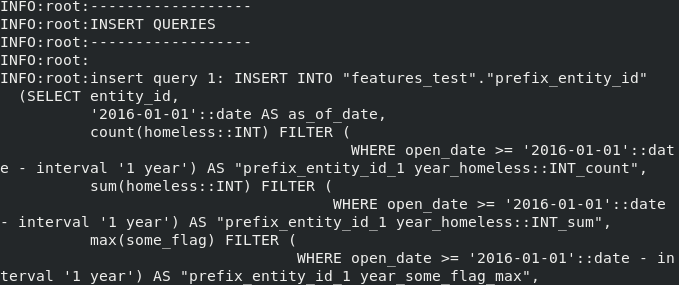

# Testing a Feature Aggregation

Developing features for Triage experiments can be a daunting task. There are a lot of things to configure, a small amount of configuration can result in a ton of SQL, and it can take a long time to validate your feature configuration in the context of an Experiment being run on real data.

To speed up the process of iterating on features, you can run a list of feature aggregations, without imputation, on just one as-of-date. This functionality can be accessed through the `triage` command line tool or called directly from code (say, in a Jupyter notebook) using the `feature_blocks_from_config` utility.

## Using Triage CLI

The command-line interface for testing features takes in two arguments:

- An experiment config file. It should have at least a `features` section, and if a `cohort_config` section is present, it will use that to limit the number of feature rows it creates to the cohort at the given date. Other keys can be in there but are ignored. In other lwords, you can use your experiment config file either before or after its fully completed.
- An as-of-date. This should be in the format `2016-01-01`.

Example: `triage experiment featuretest example/config/experiment.yaml 2016-01-01`

All given feature aggregations will be processed for the given date. You will see a bunch of queries pass by in your terminal, populating tables in the `features_test` schema which you can inspect afterwards.



## Using Python Code
If you'd like to call this from a notebook or from any other Python code, the arguments look similar but are a bit different. You have to supply the same arguments plus a few others to the `feature_blocks_from_config` function to create a set of feature blocks, and then call the `run_preimputation` method on each feature block. Make sure your logging level is set to INFO if you want to see all of the queries.


```
from triage.component.architect.feature_block_generators import feature_blocks_from_config
from triage.util.db import create_engine
import logging
import yaml

logging.basicConfig(level=logging.INFO)

# create a db_engine 
db_url = 'your db url here'
db_engine = create_engine(db_url)

feature_config = {'spacetime_aggregations': [{
	'prefix': 'aprefix',
	'aggregates': [
		{
		'quantity': 'quantity_one',
		'metrics': ['sum', 'count'],
        }
	],
	'categoricals': [
		{
			'column': 'cat_one',
			'choices': ['good', 'bad'],
			'metrics': ['sum']
		},
	],
	'groups': ['entity_id', 'zip_code'],
	'intervals': ['all'],
	'knowledge_date_column': 'knowledge_date',
	'from_obj': 'data'
}]}

feature_blocks = feature_blocks_from_config(
    feature_config,
    as_of_dates=['2016-01-01'],
    cohort_table=None,
    db_engine=db_engine,
    features_schema_name="features_test",
)
for feature_block in feature_blocks:
    feature_block.run_preimputation(verbose=True)
```
